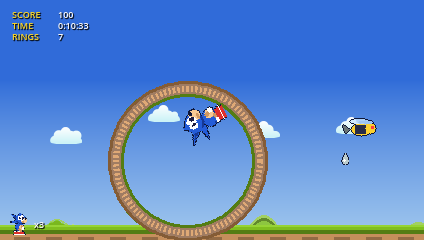
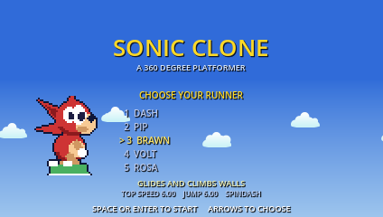
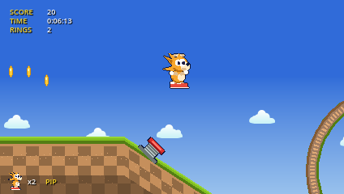
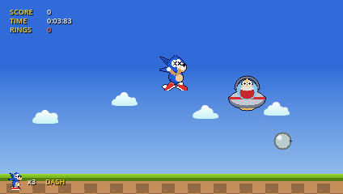
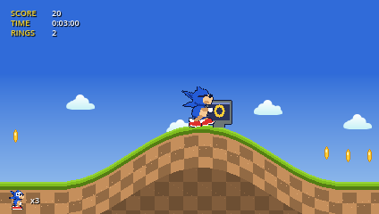

# sonic-clone

A classic-style 360° platformer built in Godot 4, with movement taken straight
from the [Sonic Retro Physics Guide](https://info.sonicretro.org/Sonic_Physics_Guide).
Three acts ending in a boss fight, five playable characters, and no vendored
third-party sprites or audio — every asset is generated by a script in `tools/`.



## Running it

Needs Godot 4.4 or newer.

```sh
godot --path .          # or just open the folder in the Godot editor
```

| Input | Action |
| --- | --- |
| ← → / A D | run |
| ↓ | crouch, and roll while moving |
| ↓ + Space | charge a spindash; release ↓ to fire |
| ↑ | look up (the camera pans after two seconds) |
| Space / Z / J | jump; press again in mid-air for the character's special move |
| Esc / P | pause, and open the resume / restart / quit menu |
| O | open options from the title screen |
| R | restart the act |
| F11 | toggle fullscreen |
| F1 | draw the collision sensors |

A gamepad works too: left stick or d-pad, bottom face button to jump, and Start
to pause.

The game boots to a title screen rather than into an act. Pick a character there
with the arrows or the number keys, then Space or Enter to start; that choice is
fixed for the whole run, so a route planned around one character's moves cannot
be undone halfway through. Losing the last life returns to the title.



## The roster



Five characters from the Sonic series, in `scripts/player/characters.gd`. Each is defined only
by what it overrides in `CharacterStats`, whose defaults *are* the SPG values —
so the reference character is the guide, exactly, and every deviation is visible
in one place.

- **SONIC** — the reference: pure SPG numbers, no mid-air move
- **TAILS** — lighter and slower; press jump again to fly, holding it to climb until
  the flight timer runs out. Flying deliberately does not count as an attack
- **KNUCKLES** — jumps lower (`6.0`); press jump again to glide, and a glide that
  touches a wall becomes a climb. Up/down climbs, jump pushes off backwards
- **SHADOW** — slightly faster; press jump again to dash at the nearest badnik, or
  straight ahead if there isn't one. The dash counts as an attack
- **AMY** — trades the spindash away for a hammer swing that widens the damage
  box far enough to clear badniks from standing height

All five share one hook — jump pressed while already airborne — implemented in
`scripts/player/abilities.gd`. Everything else about movement is common code.

The roster is chosen on the title screen (`scripts/ui/menu.gd`) and cannot change
mid-run.

## Options and records

The title screen opens Options with **O**, and the pause menu has the same screen.
Music and sound-effect volume are independent, fullscreen changes immediately
(F11 toggles it anywhere),
and each gameplay keyboard action can be rebound. Controller movement, jump and
pause bindings stay available when keyboard controls are changed. A key belongs
to one action at a time, Esc always pauses and backs out of menus, and F1, F11
and O are reserved.

Settings are saved to Godot's per-user `settings.cfg`. Finishing an act also
saves the best time for that character and act to `progress.cfg`; character
select shows all three personal bests and the number of cleared acts. Slower
finishes never overwrite a faster record.

## The boss



Act 3 ends in the zone's climax. A hover pod sweeps a sealed arena dragging a
wrecking ball on a chain; the pod is the only target, and only an attacking
player can hurt it — rolling, jumping, an air dash or a hammer swing. Each of the
eight hits knocks it back, makes it flinch and speeds up the next sweep, so the
fight tightens as it goes.

The ball hurts on contact whatever the player is doing. That is deliberate: it is
what stops the fight being a jump-spam contest, and it is why the act stocks rings
just before the arena.

Waking the boss seals the arena behind the player and pins the camera to it.
Beating it drops the prize capsule, and landing on the capsule's switch is what
clears the act — act 3 has no goal sign.

## How the movement works



Every constant in `scripts/player/player.gd` is the published SPG value, in
pixels per frame at 60fps — acceleration `0.046875`, friction `0.046875`,
deceleration `0.5`, top speed `6`, air acceleration `0.09375`, gravity
`0.21875`, jump force `6.5` with the `-4` release cap, roll friction
`0.0234375`, and the three slope factors (`0.125` running, `0.078125` rolling
uphill, `0.3125` rolling downhill). `_physics_process` scales by `delta * 60`,
so behaviour is unchanged if the tick rate moves.

Collision does **not** use `move_and_slide`. Following the SPG sensor model (and
the approach Sonic Worlds Next takes in Godot), `scripts/player/sensors.gd`
raycasts six sensors every frame — two floor, two ceiling, two push — and reads
the ground angle from the surface normal. That brings the rest of the guide with
it: ground snapping capped at `min(|xsp| + 4, 14)`, the wall-slip and fall-off
rules below 2.5 speed, and landing speed converted according to how steep the
surface is.

Because angles come from real geometry rather than per-tile height masks, terrain
is generated as collision polylines instead of a tilemap. Each act is an
`ActData` (see `scripts/level/acts.gd`) describing its ground as a list of
segments — `flat`, `slope`, `hill`, `valley`, `ramp`, `gap`, `loop` — which Zone
walks left to right into both the collision chain and the matching textured
strip, so the visuals cannot drift from what the sensors hit.

A polyline is one floor per x, which rules out ceilings and upper routes, so
`Block` (`scripts/world/block.gd`) fills the gap: a rectangle solid on all four
faces, placed from act data as a `block` (a shelf at a given height) or a `wall`
(a pillar standing on the ground). Act 2 is built around them — a ledge route
above the road, a roofed corridor, and an overhead block the ground passes under
whose face a glider can grab and climb.

### Loops

A loop is two arcs on opposite collision layers, tangent to the ground at the
bottom. The right arc is solid on layer A, the left arc on layer B, and three
switchers hand the player between them:

- **left edge** selects A, so someone arriving from the left rides up the right
  arc while the left arc is see-through
- **centre, upper half only** switches by direction, so heading left at the apex
  selects B and the descent becomes solid
- **right edge** selects B, mirroring the entry for a player coming the other way

Leaving B active at the bottom of the descent is what makes the exit work: the
right arc is no longer solid, so the player rolls out instead of looping forever.

## Layout

```
project.godot          autoloads, input map, 424x240 viewport
scenes/game.tscn       the whole game; everything else is built in code
scripts/player/        physics, sensors, character stats, abilities
scripts/world/         terrain, blocks, loops, path switchers, camera, parallax
scripts/objects/       rings, springs, monitors, badniks, spikes, platforms, goal
scripts/level/         act data (acts.gd) and the builder/act flow (zone.gd)
scripts/ui/            title menu, pause menu, in-game readout and results
assets/                generated art and audio, plus the Kenney CC0 sources
export_presets.cfg     macOS / Linux / Windows release presets
tools/                 asset generators, build script, playtest harness
tests/                 the physics regression suite
```

## Assets

Nothing is committed that a script cannot rebuild:

```sh
python3 tools/gen_art.py     # sprites, tiles, parallax layers
python3 tools/gen_audio.py   # sound effects and the music loop
```

`gen_art.py` samples its palette from Kenney's
[Platformer Art Complete Pack](https://kenney.nl/assets/platformer-art-deluxe)
(CC0, sources kept in `assets/kenney/`) and reuses its clouds and bush art for
the parallax bands; everything else — the mascot, objects, terrain textures — is
drawn procedurally so the art lines up with the generated collision.
`gen_audio.py` synthesises the effects and an original chiptune loop from square,
triangle and noise voices, so the repo carries no third-party audio licences.

`tools/pngio.py` is a small PNG reader/writer built on `zlib` and `numpy`,
because Pillow was not installable on the machine this was written on. `numpy` is
the only dependency.

## Builds

```sh
GODOT=/path/to/godot ./tools/build.sh
```

Exports macOS (universal `.app`), Linux (x86_64) and Windows (x86_64) from
`export_presets.cfg`. Export templates matching the editor version have to be
installed first — the editor fetches them under *Editor > Manage Export
Templates*.

The macOS build has been run outside the editor and boots clean: Metal
initialises, the title screen comes up, and it exits 0 with nothing in the log.
The shipped package carries 177 files and excludes `tests/`, `tools/`, `docs/`
and `build/` — verified by reading the `.pck` directory rather than trusting the
filter.

## Tests

```sh
GODOT=/path/to/godot ./tools/test.sh
```

The suite drives the real player through the real level builder and asserts the
published SPG numbers rather than snapshotting behaviour: acceleration, friction,
braking and the brake-through-zero snap, top speed, jump force and release cap,
gravity, downhill slope gain, rolling friction and the roll hitbox, and the
spindash. On top of that it checks the abilities, that blocks are solid on every
face, that a wall can be climbed and pushed off, that a loop is traversed upside
down with a path-layer flip, that the game boots to the menu and the menu's
character choice reaches the run, that pausing actually freezes the player and
that no exit from the pause menu leaves the tree paused, the boss fight (it wakes
in its arena, locks the camera, takes hits only from an attacking player, dies on
the eighth and drops a capsule that clears the act, and its ball hurts even an
attacking player), and three level-data guards — every object kind is one the
builder knows, no wall on a critical path is taller than the weakest jump in the
roster can clear, and no object is stranded over a gap or floating off the block
meant to hold it. It exits non-zero on failure.

The guards have already earned their place: the wall check caught a 132px wall
that no character could jump, the climb test caught the push sensors zeroing
horizontal speed on contact (which left the glide with no direction to probe, so
it never grabbed a wall), and the placement check reproduces both mistakes made
by hand while act 2 was being built — a reward over a pit, and one sitting just
past the edge of its ledge.

## Playtest harness

`tools/capture.gd` runs the real game under synthetic input and prints player
state or writes viewport snapshots. It is how the physics above was checked:

```sh
# accelerate right, jump at frame 288, report state through the first loop
godot --headless res://tools/capture.tscn --quit-after 6000 -- \
    --frames=660 --hold=move_right@1-660 --tap=jump@288 --probe=610-660

# render frames to disk
godot res://tools/capture.tscn -- --out=/tmp/run --shots=180,620 --frames=660 \
    --hold=move_right@1-660 --tap=jump@288

# drop the player somewhere specific, or dump the surface the sensors see
godot --headless res://tools/capture.tscn -- --warp=5700 --frames=200
godot --headless res://tools/capture.tscn -- --frames=6 --surface=380,580,20

# pick an act and a character: act 2 as the glider, gliding from frame 182
godot --headless res://tools/capture.tscn -- --act=1 --char=2 --warp=2760 \
    --frames=280 --hold=move_right@1-280,jump@186-280 --tap=jump@170,jump@182
```

## Licence

Original code and generated assets are released under CC0. The Kenney sources in
`assets/kenney/` are CC0, with their licence text alongside them. This is an
unofficial fan project: the character names and the art in `assets/shadow.png`
and `assets/sonic game.png` refer to Sega's Sonic the Hedgehog series, which
remains Sega's property and is not covered by the CC0 release.
